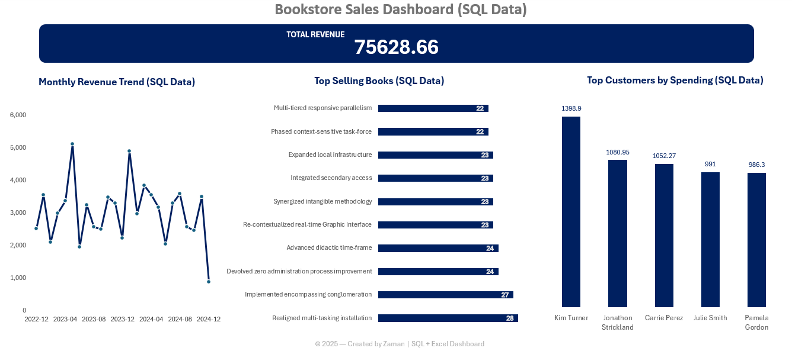

# 📚 **Bookstore Sales Analytics — SQL + Excel Dashboard**

Yeh project aik end-to-end **Data Analytics Case Study** hai jisme:

- **PostgreSQL** → Data analysis  
- **DBeaver** → ERD + SQL execution  
- **Excel** → Dashboard visualization  

Is README ko **best professional mix style** me design kiya gaya hai:  
➡️ **Key screenshots embed**  
➡️ **Baqi items clickable links**  
Taake project clean + professional + recruiter-friendly lage.

---

# 🧱 **Database ERD (Main Visual)**


---

# 📈 **Dashboard Full View (Main Visual)**



---

# ⭐ **Key KPI Chart (Main Visual)**


---

# 🗂️ **Project Structure (Clickable Links)**

### 📁 **Data Files**
- [Books.csv](data/Books.csv)  
- [Customers.csv](data/Customers.csv)  
- [Orders.csv](data/Orders.csv)

### 🖼️ **Screenshots (Additional)**
- [Books Sample](screenshots/02_Books_sample.png)
- [Customers Sample](screenshots/02_Customers_sample.png)
- [Orders Sample](screenshots/02_Orders_sample.png)
- [SQL Output — Total Revenue](screenshots/03_sql_total_revenue_output.PNG)
- [SQL Output — Monthly Revenue](screenshots/03_sql_monthly_revenue_output.png)
- [SQL Output — Top Selling Books](screenshots/03_sql_top_selling_books_output.PNG)
- [SQL Output — Top Customers](screenshots/03_sql_top_customers_output.PNG)
- [Dashboard — Monthly Revenue Chart](screenshots/04_dashboard_monthly_revenue_chart.PNG)
- [Dashboard — Top Selling Books Chart](screenshots/04_dashboard_top_selling_books_chart.PNG)
- [Dashboard — Top Customers Chart](screenshots/04_dashboard_top_customers_chart.PNG)

### 📄 **Files**
- [Excel Dashboard File](SQL_Bookstore_Dashboard.xlsx)  
- [Full SQL Script](online_bookstore_sql_analysis.sql)  
- [License](LICENSE)

---

# 🛠️ **Tools Used**

| Tool | Purpose |
|------|---------|
| **PostgreSQL** | SQL queries, joins, aggregations |
| **DBeaver** | ERD + SQL execution |
| **Excel** | Analytical dashboard |
| **CSV Files** | Raw dataset |

---

# 🧱 **Database Schema**

### 📘 **Books**
`Book_ID · Title · Author · Genre · Published_Year · Price · Stock`

### 👤 **Customers**
`Customer_ID · Name · Email · Phone · City · Country`

### 🛒 **Orders**
`Order_ID · Customer_ID (FK) · Book_ID (FK) · Order_Date · Quantity · Total_Amount`

---

# 📝 **Key SQL Queries Used**

## ⭐ Total Revenue
```sql
SELECT SUM(Total_Amount) AS total_revenue FROM Orders;
```

## ⭐ Monthly Revenue Trend
```sql
SELECT DATE_TRUNC('month', Order_Date) AS month,
       SUM(Total_Amount) AS monthly_revenue
FROM Orders
GROUP BY month
ORDER BY month;
```

## ⭐ Top 10 Best-Selling Books
```sql
SELECT b.Title, SUM(o.Quantity) AS total_sold
FROM Orders o
JOIN Books b ON b.Book_ID = o.Book_ID
GROUP BY b.Title
ORDER BY total_sold DESC
LIMIT 10;
```

## ⭐ Top 5 Customers
```sql
SELECT c.Name, SUM(o.Total_Amount) AS amount_spent
FROM Orders o
JOIN Customers c ON c.Customer_ID = o.Customer_ID
GROUP BY c.Name
ORDER BY amount_spent DESC
LIMIT 5;
```

📄 **Full SQL Script:**  
➡️ [Download Here](online_bookstore_sql_analysis.sql)

---

# 📊 **Excel Dashboard Overview**

Includes:  
✔ KPI Cards  
✔ Monthly Revenue Trend  
✔ Top Selling Books  
✔ Top Customers  

Additional charts (links above).

---

# 🔍 **Insights Generated**

### 📌 Sales
- Total revenue  
- Monthly trends  
- High-demand books  

### 📌 Customers
- Top spenders  
- Customer segmentation  

### 📌 Inventory
- Stock levels  
- Low-stock items  
- Author performance  

---

# 🏁 **Conclusion**

Yeh project demonstrate karta hai:

- Real SQL analysis  
- Business insights generation  
- Professional Excel dashboard making  
- Clean dataset management  
- Strong Data Analyst portfolio skills  

---

# 👤 **Author**

**Zaman**  
BS Data Science Student — UCP Lahore  
Aspiring Data Analyst  

